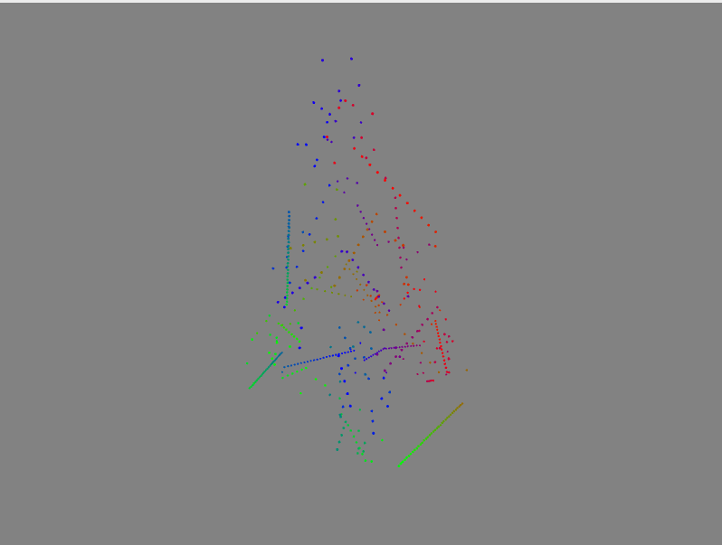

# X-mas Tree Mapping Utility

This is all meant to interface with Matt Parker's lovely [addressable LED christmas tree](https://github.com/standupmaths/xmastree2021).

Written in Rust because I wanted to.

It provides a nice visualizer/simulator/thingie with a few selectable parameters to
control the view of any tree, and can import any tree described with the GIFT format.

## Currently supported patterns

- `Green`: Lights up all lights as green, simply used to implement initial pattern format.
- `Rainbow`: Chases rainbows through the lights in a linear fashion, no attention paid to layout.

## General TODO

In rough order of priority:

- pattern export to CSV format
- streamline selection of different patterns
- customizable view (maybe also mouse-pannable?)
- export-only mode, find a way to not trigger macroquad
- generic 3d implementation
- more generic patterns (find a way to import command-line configuration into pattern config/generation)
